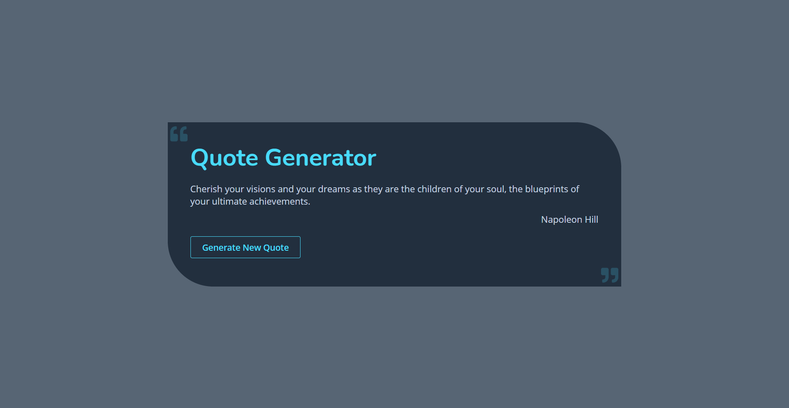

# Quote Generator

[Live Preview]() 🚀

> This simple project is based on TypeFit API for quotes. It fetches the quotes on page load and displays a random one. It is possible to generate a new random quote by clicking the button 'Generate New Quote'.

### Tech Stack

- React
- SASS
- CSS Modules
- FontAwesome Icons
- TypeFit API
- Netlify for hosting

---

### Mobile View Illustration

---

### Desktop View Illustration

